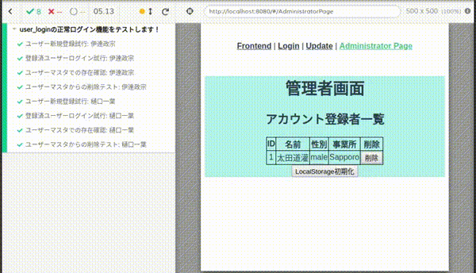

# user_login

ログイン機能（Vue.js ＋ Express.js ＋ SQLite） 
何かしらの Web サービスと想定してのログイン機能とアカウント管理を行うシステム

- [user_login](#userlogin)
  - [実行方法](#%e5%ae%9f%e8%a1%8c%e6%96%b9%e6%b3%95)
    - [起動](#%e8%b5%b7%e5%8b%95)
    - [秘密鍵の作成（gitのssh-keygenを用いて作成する）](#%e7%a7%98%e5%af%86%e9%8d%b5%e3%81%ae%e4%bd%9c%e6%88%90git%e3%81%aessh-keygen%e3%82%92%e7%94%a8%e3%81%84%e3%81%a6%e4%bd%9c%e6%88%90%e3%81%99%e3%82%8b)
    - [Cypress Integration Test](#cypress-integration-test)
  - [ファイル構成](#%e3%83%95%e3%82%a1%e3%82%a4%e3%83%ab%e6%a7%8b%e6%88%90)
  - [実装機能](#%e5%ae%9f%e8%a3%85%e6%a9%9f%e8%83%bd)
  - [あったらいい機能](#%e3%81%82%e3%81%a3%e3%81%9f%e3%82%89%e3%81%84%e3%81%84%e6%a9%9f%e8%83%bd)
  - [対応中の不具合](#%e5%af%be%e5%bf%9c%e4%b8%ad%e3%81%ae%e4%b8%8d%e5%85%b7%e5%90%88)
  - [問題点](#%e5%95%8f%e9%a1%8c%e7%82%b9)
  - [開発環境](#%e9%96%8b%e7%99%ba%e7%92%b0%e5%a2%83)

## 実行方法

### 起動

1. `cd MyApp/`
1. `npm install`
1. `npm start`
   - これにより、Vue.js のフロントエンドと Express.js のバックエンド双方が立ち上がります
   - `localhost:8080` がフロントエンド側、`localhost:8000` がバックエンド側と仮定して開発中
1. `localhost:8080`にアクセス

### 秘密鍵の作成（gitのssh-keygenを用いて作成する）
- アクセストークンの発行時に、サーバ側で秘密鍵を用いている
  - 秘密鍵がない場合、サーバはトークンを発行せず特に意味のない文字列のダミーのCookieをクライアントに返す
- 秘密鍵はコード上で環境変数から取得している
  
1. `cd MyApp/`
2. `npm i dotenv -D`
     - 環境変数を管理するためのライブラリをインストール
3. `touch .env`
     - 環境変数を管理するためのファイルを作成
4. `ssh-keygen -t rsa -b 4096 -C "Comment"`
     - 秘密鍵・公開鍵の作成（以下対話形式の入力内容について）
       - 1 回目：鍵の保存先
       - 2 回目：鍵のパスフレーズ（パスワード）
       - 3 回目：鍵のパスフレーズ（再確認）
5. 指定した保存先に秘密鍵・公開鍵があることを確認する
     - id_rsa : 秘密鍵　 id_rsa.pub ：対応する公開鍵
6. `cat 生成した秘密鍵 | sed -e :loop -e 'N; $!b loop' -e 's/\n/\\n/g'`
      - 秘密鍵の改行コードを`\n`に置換し一行に環境変数に対応させる
7. `.env`ファイルに先ほど一行にした秘密鍵をセットする
8. **`.env`ファイルと秘密鍵のディレクトリは`.gitignore`の対象にする**

### Cypress Integration Test

ユーザー登録とログイン処理が正常に成功するかどうかテストする。これにより、高速かつ漏れなく作ったサービスの動作確認ができる。

1. サーバーが実行されていることを確認
2. `cd MyApp`
3. `./node_modules/.bin/cypress open`
4. 立ち上がったウインドウ上で`user_login.spec.js`をクリックして実行

今回の試験では２人のテストユーザーを使ったが、全体でも５秒程度しかかからなかった。

1. 登録ページに行き、新しいユーザーを登録して「登録成功」のメッセージがでることを確認する。
2. ログインページに行きその情報でログインを試行し、「ログイン成功」のメッセージがでることを確認する。
3. 管理者画面ページに行き、先程登録したユーザがリストに入っていることを確認する。
4. 新規登録したユーザを削除する。

## ファイル構成

- MyApp :vue-cli で構築されたプロジェクトファイル
  - MyApp/src/ :フロントエンド側のファイルをまとめたディレクトリ
    - MyApp/src/js/axios_http_communication.js :HTTP
      通信を行う JS モジュール
    - MyApp/src/views/Frontend.vue :フロントエンドの view の中核になるファイル
- MyApp/Backend/ :バックエンド側のファイルをまとめたディレクトリ
  - MyApp/Backend/index.js :Backend 側の処理を行う JS ファイル
  - MyApp/Backend/account.sqlite :DB 本体

## 実装機能

- アカウント追加
  - ボタンクリックで入力したフォーム内容を DB に登録（ID は DB 内で autoIncrement で設定）
  - 各フォームでユーザー名、性別、事業所名を選択できるようにした
  - 各フォームの例外処理にも対応
- アカウント参照
  - Frontend で登録したアカウントデータを Administrator Page で DB 経由で参照する
- アカウント更新
  - アカウント情報変更フォームで入力した ID を元に既に登録しているアカウント情報を更新する
  - 登録されていない ID が入力された場合は更新作業を行わない
- アカウント削除
  - 対応するアカウントの削除ボタンで可能
- アクセストークンの発行
  - ログインを行ったユーザに対してトークンを発行する
  - トークンはCookieに保存され、そのCookieを元にユーザを認証し、自動的にログイン処理を行う
- ローカルストレージによるアクセスカウンタ

## あったらいい機能

- ログイン機能が実装できたら、CSV ファイルを DB にインポートさせてデータ分析などを行いたい

## 対応中の不具合

- アカウント削除ボタンのハンドラが上手く動作していないため、削除したいアカウントを指定できない
- 着色機能の不具合
  - 1 アカウントにつき 1 文字にしか反映されない
  - 2 文字以上は未対応
  - CRUD 処理実装中のため、この機能はマージしていない
- Vuetify適用によりHTMLの要素名等が変わったためCypressが動作しない

## 問題点

- sequelize-cli で作成された config.json の storage は DB へのパスが設定されているが、API サーバが実行中は MyApp/（npm start）からの相対パスでないと接続できず、  
  CLI で sequelize-cli を用いて Migration 等を行うときはコマンドを実行するカレンとディレクトリからの相対パスでないと DB と接続できない
- モジュール化した axios_http_communication.js 経由でサーバとの HTTP 通信を行うと、レスポンス結果が Vue 側で検知できないため、現在使用していない個所もある

## 開発環境

- VSCode/Git
- JavaScript
  - Vue.js (framework)
    - Vuetify(framework)
  - Express.js (framework)
  - axios (npm Library)
  - Vue CLI (npm Library)
  - sequelize (npm Library)
  - sequelize-cli (npm Library)
  - dotenv (npm Library)
  - jsonwebtoken (npm Library)
  - cypress (npm Library)
- SQLite
